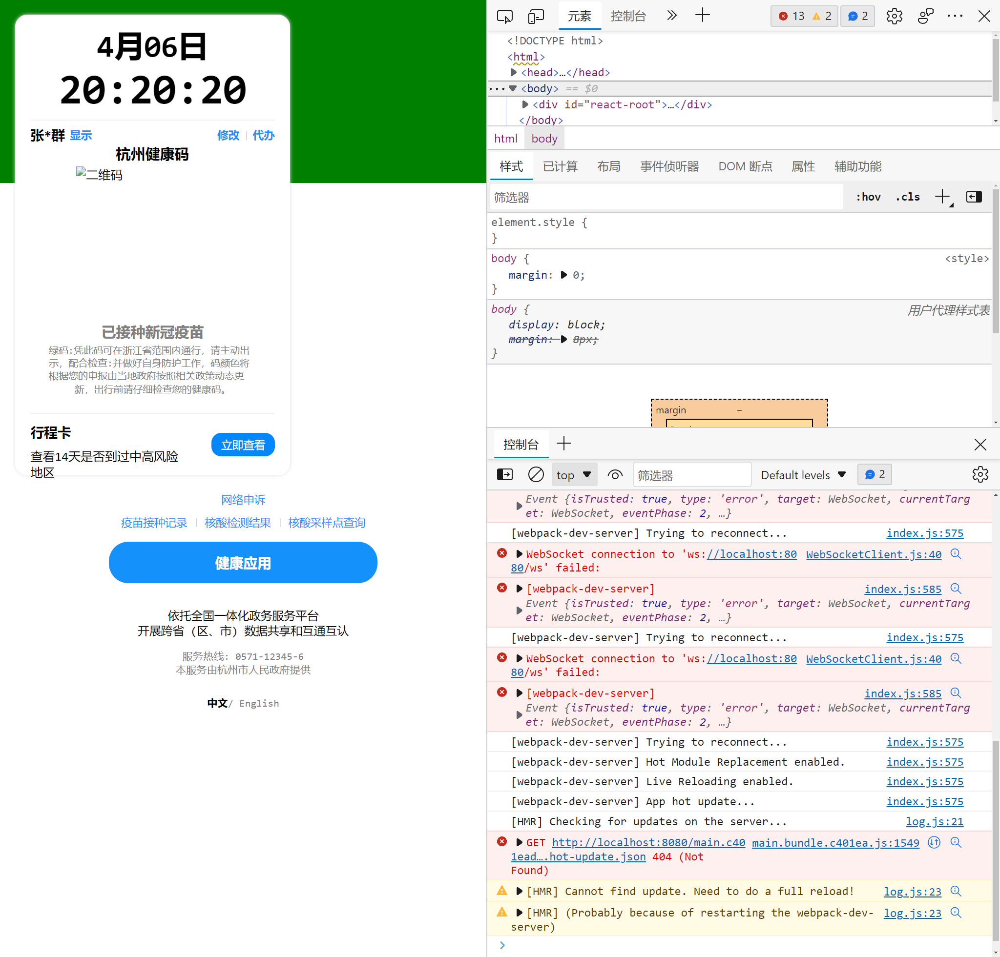

# 杜小舟的健康码工程

### 快速上手

1. 打开命令行 , 输入`npm i` 回车 ,
2. 出现 `added 528 packages in 3s` 后
3. 输入 `npm start`
4. 出现 `webpack 5.72.0 compiled successfully in 2598 ms` 后 , 找到上面绿色字 `<i> [webpack-dev-server] Loopback: http://localhost:8080/` 这一行后
5. 在浏览器打开 `http://localhost:8080/` 即可看到网页

#### 
效果如图

